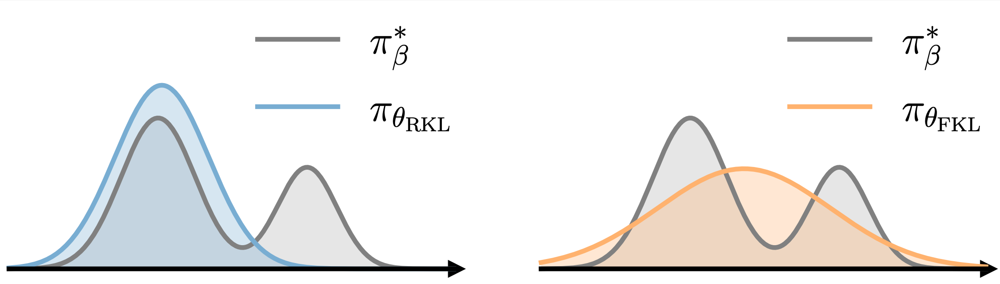

# Towards Efficient and Exact Optimization of Language Model Alignment

## Overview

This is the official pytorch implementation of the EXO algorithm for *efficient exact optimization* of aligning language models (LMs) with human preferences, as described in [Towards Efficient and Exact Optimization of Language Model Alignment](https://arxiv.org/pdf/2402.00856.pdf). 

<div align="center">
  
</div>

EXO essentially minimizes the reverse KL between the empirical distributions defined by the policy and the reward. As a comparison, DPO corresponds to minimizing the forward KL. The above figure illustrates the distinct behavior of policies obtained by minimizing (a) the reverse KL and (b) the forward KL.

## Dependencies

```
python >= 3.9.0
transformers >= 4.34.1
deepspeed >= 0.11.2
```

It is recommended to precomplie the required extensions when installing `deepspeed` (For more details refer to the [installation guideline of deepspeed](https://www.deepspeed.ai/tutorials/advanced-install/)):

```bash
DS_BUILD_FUSED_ADAM=1 DS_BUILD_TRANSFORMER=1 DS_BUILD_TRANSFORMER_INFERENCE=1 pip install deepspeed 
```

## General Guideline

EXO supports the settings of (i) training directly on the preference data and (ii) training with the supervision provided by a learned reward model. The pipeline is comprised of the following stages:

- Supervised fine-tuning (SFT) stage: 
  - Train the SFT policy: `train_sft.sh`.
  - (Optional) Sample from the SFT policy: `inference_sft.sh`.

- Reward Model (RM) stage:
  - (Optional) Train the RM: `train_rm.sh`.
  - Score the prompt-generation pairs with reward: `inference_rm.sh`.

- Alignment stage:
  - Train the policy to align with human preferences using EXO: `train_exo.sh`.
  - Sample from the learned policy: `inference_sft.sh`.


To train on a custom dataset, one should create a dataset class by inheriting from the base class `PromptRawDataset` located in `src/utils/data/raw_datasets.py`. Then, simply add a few lines of code to the `get_raw_dataset` method in `src/utils/data/data_utils.py` to utilize the custom dataset.


## SFT Stage

### Training 
In the SFT stage, the LM is fine-tuned with supervised MLE on the data that is supposed to be obtained from the same distribution as the preference data. One can simply finetune on the chosen texts of the preference data if no such data is available.
<details>
<summary>
SFT data format
</summary>

```json
{
  "prompt": "prompt",
  "chosen": "chosen text"
}
```

</details>

<details>
<summary>
Training script
</summary>

```bash
# Any causal HuggingFace model (`AutoModelForCausalLM` class)
INIT_MODEL_NAME=custom-model
# local path to the checkpoint of the initial model
INIT_MODEL_PATH=/local/path/to/init/model
# type of the model
MODEL_TYPE=sft
# name of the sft data, default format: "name/sft", should be added to `src/utils/data/data_utils.py`
DATA_NAME=custom-data/sft
# local path to the sft data
DATA_PATH=/local/path/to/sft/data

bash exp/custom_exp/train_sft.sh $INIT_MODEL_NAME $INIT_MODEL_PATH $MODEL_TYPE $DATA_NAME $DATA_PATH
```
Other hyperparameters for training can be specified in `exp/custom_exp/train_sft.sh`. The SFT model will be saved in `models/custom-model_custom-data/sft`.


</details>

### Inference 

(**Optional but recommended**) To utilize supervision of the reward model for alignment, one need to sample from the SFT model and later use the reward model to score the inference results.
<details>
<summary>
Inference script
</summary>

```bash
# comma separated device ids
DEVICE_IDS=0,1,2,3
# data name and data path concatenated by colon
DATA_NAME_PATH=custom_data/sft:/local/path/to/sft/data
# local path to SFT model
MODEL_PATH=models/custom-model_custom-data/sft


# inference on train set
SPLIT=train
bash exp/custom_exp/inference_sft.sh $DEVICE_IDS $DATA_NAME_PATH $SPLIT $MODEL_PATH 

# inference on test set
SPLIT=test
bash exp/custom_exp/inference_sft.sh $DEVICE_IDS $DATA_NAME_PATH $SPLIT $MODEL_PATH 
```

Other hyperparameters for decoding can be specified in `exp/custom_exp/inference_sft.sh`. The inference results will be saved under the same root directory of the SFT data.
</details>


<details>
<summary>
SFT generated data format
</summary>

```json
{
  "prompt": "prompt",
  "completions": ["text A", "text B", ...]
}
```
</details>


## RM stage

### Training

(**Optional but recommended**) In order to utilize the continuous preference signal, one can train a reward model on the preference data to predict the human preference.


<details>
<summary>Preference data format</summary>

```json
{
  "prompt": "prompt",
  "chosen": "chosen text", 
  "rejected": "rejected text"
}
```
</details>


<details>
<summary>Training script</summary>

```bash
# Any HuggingFace model (`AutoModel` class), use the last position of the sequence for prediction
INIT_MODEL_NAME=custom-model
# local path to the checkpoint of the initial model
INIT_MODEL_PATH=/local/path/to/init/model
# type of the model
MODEL_TYPE=rm
# name of the preference data, default format: "name/pref", should be added to `src/utils/data/data_utils.py`
DATA_NAME=custom-data/pref
# local path to the pref data
DATA_PATH=/local/path/to/pref/data

bash exp/custom_exp/train_rm.sh $INIT_MODEL_NAME $INIT_MODEL_PATH $MODEL_TYPE $DATA_NAME $DATA_PATH
```

Other hyperparameters for training can be specified in `exp/custom_exp/train_rm.sh`. The SFT model will be saved in `models/custom-model_custom-data/rm`.

</details>

### Inference

(**Optional but recommended**) Then use the reward model to score the SFT generated data with continuous reward. 

<details>
<summary>
Inference script
</summary>

```bash
# comma separated device ids
DEVICE_IDS=0,1,2,3
# local path to the sft generated data
DATA_PATH=/local/path/to/sft/gen/data
# local path to the reward model
MODEL_PATH=models/custom-model_custom-data/rm

# inference on train set
SPLIT=train
bash exp/custom_exp/inference_rm.sh $DEVICE_IDS $DATA_NAME_PATH $SPLIT $MODEL_PATH 

# inference on test set
SPLIT=test
bash exp/custom_exp/inference_rm.sh $DEVICE_IDS $DATA_NAME_PATH $SPLIT $MODEL_PATH 
```

Other hyperparameters for inference can be specified in `exp/custom_exp/inference_rm.sh`. The inference results will be saved under the same root directory of the SFT data.

</details>

<details>
<summary>RM labeled data format</summary>

```json
{
  "prompt": "prompt",
  "completions": ["text A", "text B", ...],
  "rewards": [reward A, reward B, ...]
}
```
</details>


## Alignment stage

### EXO & DPO

In the alignment stage, the SFT model is fine-tuned to align with human preferences by training on either the preference data or the RM labeled data.

Before training, the preference dataset should be converted to the same format as the RM labeled data:
```bash
python src/utils/data/pref_to_rw.py /local/path/to/preference/data
```

<details>
<summary>Training script</summary>

To train the policy using the EXO algorithm, run the following commands:

```bash
# Any causal HuggingFace model (`AutoModelForCausalLM` class)
INIT_MODEL_NAME=custom-model
# local path to the SFT model
INIT_MODEL_PATH=/local/path/to/sft/model
# type of the model
MODEL_TYPE=align
# name of the reward data, default format: "name/rw", should be added to `src/utils/data/data_utils.py`
DATA_NAME=custom-data/rw
# local path to the reward data or preference data
DATA_PATH=/local/path/to/rw/data
# supported loss type: exo-pref / exo-rw / dpo-pref / dpo-rw
LOSS_TYPE="exo-pref"
# number of contrastive samples, should not be greater than the number of completion candidates in the dataset.
NUM_CONTRASTIVE=2


bash exp/custom_exp/train_exo.sh $INIT_MODEL_NAME $INIT_MODEL_PATH $MODEL_TYPE $DATA_NAME $DATA_PATH $LOSS_TYPE $NUM_CONTRASTIVE
```

Other hyperparameters for training can be specified in `exp/custom_exp/train_exo.sh`. 

To train the policy using the DPO algorithm, simply change the `LOSS_TYPE` to either `dpo-pref` or `dpo-rw`.

</details>


## Reproducing experiments in the paper

We also provide guidelines to reproduce the experiments on the three public datasets: [IMDB](https://ai.stanford.edu/~amaas/data/sentiment/), [TL;DR](https://huggingface.co/datasets/openai/summarize_from_feedback) and [Anthropic-HH](https://huggingface.co/datasets/Anthropic/hh-rlhf) to facilitate future study:
- [Reproducing the IMDB experiment](exp/imdb_exp/README.md)
- [Reproducing the TL;DR experiment](exp/tldr_exp/README.md)
- [Reproducing the Anthropic-HH experiment](exp/hh_exp/README.md)

## Citing

```
@article{Ji2024TowardsExact,
  title={Towards Efficient and Exact Optimization of Language Model Alignment},
  author={Haozhe Ji, Cheng Lu, Yilin Niu, Pei Ke, Hongning Wang, Jun Zhu, Jie Tang, Minlie Huang},
  year={2024},
  journal={arXiv preprint arXiv:2402.00856},
  url={https://arxiv.org/abs/2402.00856}
}
```

Please kindly cite our work if you find the paper or this repository useful :)

